# Bosco Mini Portfolio Website

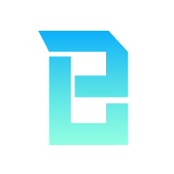

This project is a dynamic and responsive personal portfolio website for CHEUNG Tsz Lai Bosco. It presents professional experience, education, projects, and skills in a clean and easy-to-navigate interface.

Built with React, TypeScript, Tailwind CSS, Mantine, and Firebase, the app focuses on maintainability, smooth UI behavior, and a modern dashboard editing workflow.

## Project Overview

Bosco Mini Portfolio is designed with two main experiences:

- Public-facing pages that showcase profile, projects, education, and skills
- A protected dashboard for managing portfolio content with create, update, and delete actions

The interface is fully responsive and supports desktop and mobile layouts, with multilingual content support and real-time updates from Firestore.

## UI Walkthrough

### Home Page /

The Home page is the public-facing landing experience. Visitors can quickly browse profile highlights, work experience, education background, projects, and skill sets in a clean, responsive layout.

| Desktop | Mobile |
| --- | --- |
| 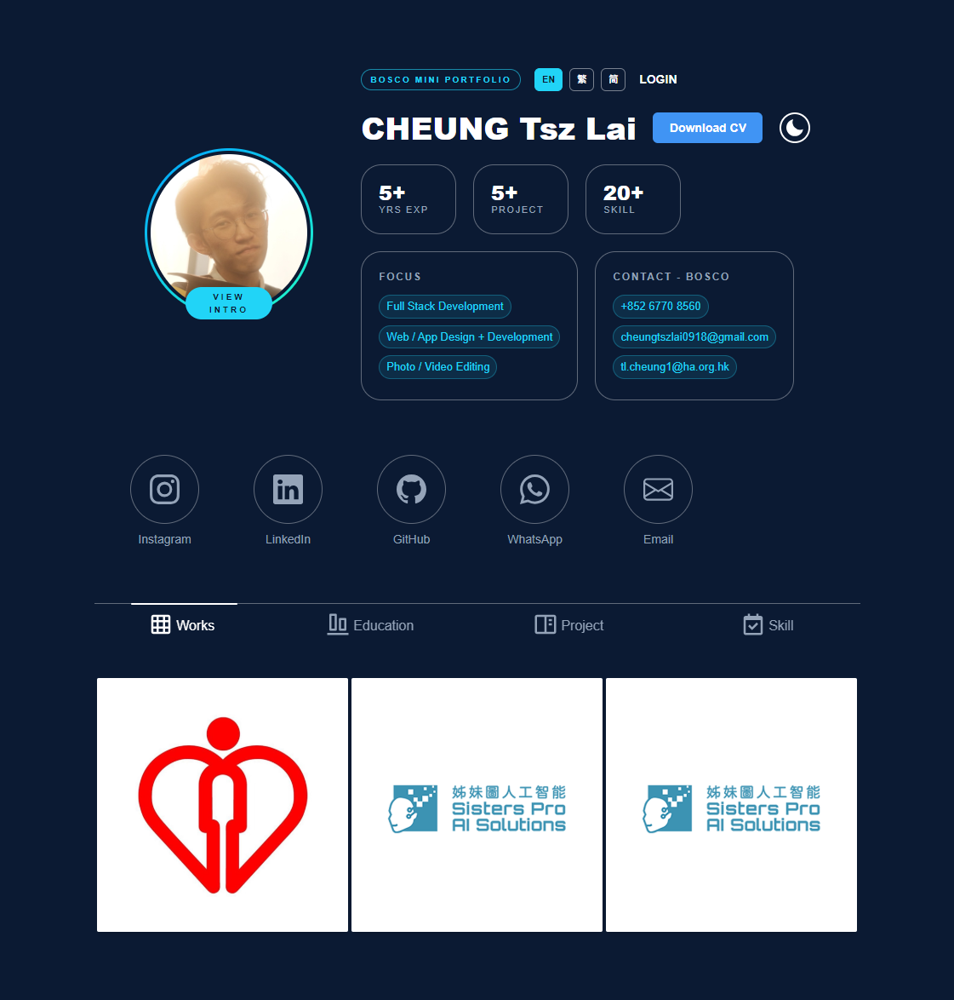 | 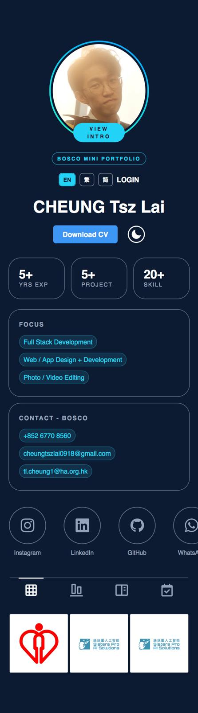 |

### Login Page /login

The Login page secures access to the management dashboard. Authenticated users can sign in with Firebase Authentication before performing any content updates.

| Desktop | Mobile |
| --- | --- |
| 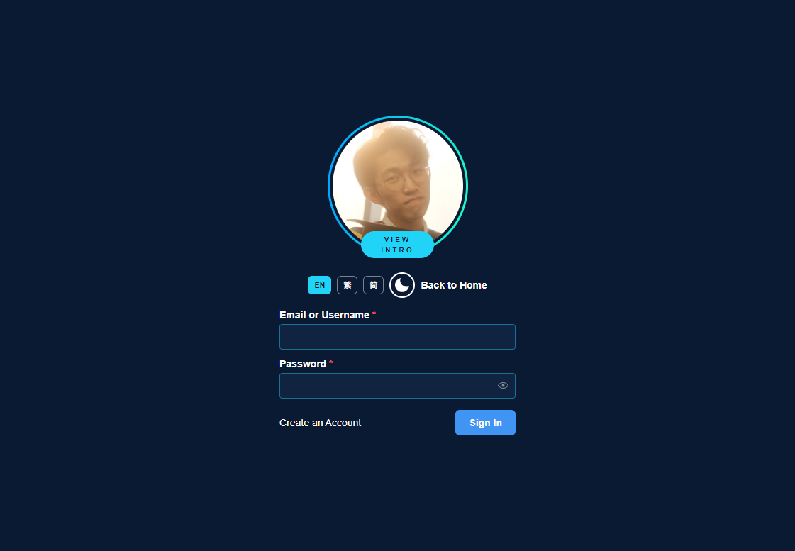 | 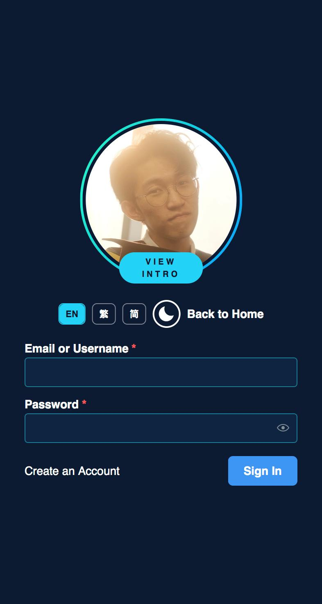 |

### Dashboard Main View /dashboard

The Dashboard is the content control center. It presents portfolio records in organized sections and allows admins to review existing entries before editing.

| Desktop | Mobile |
| --- | --- |
| 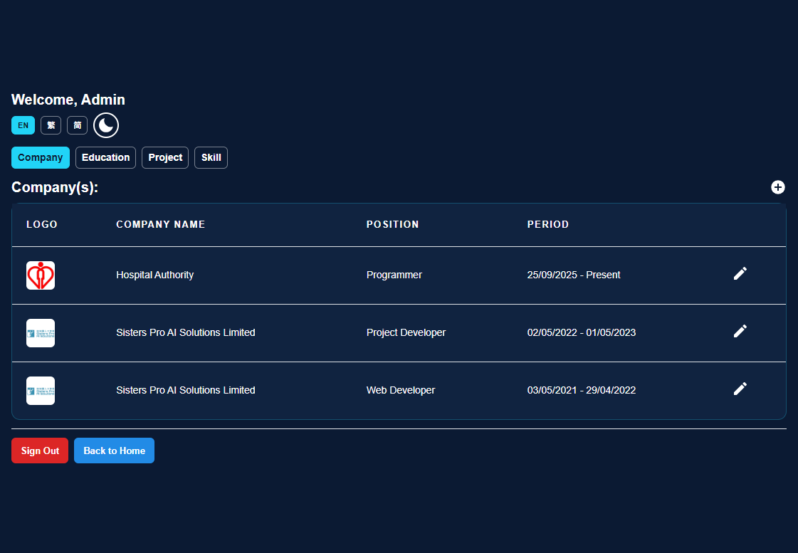 | 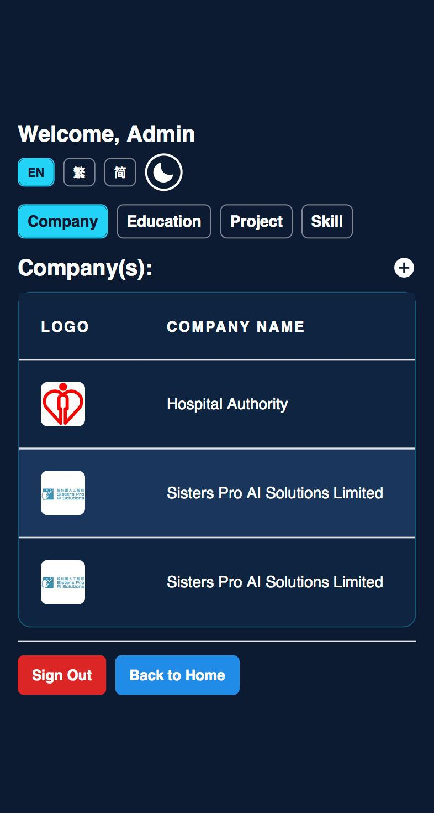 |

### Dashboard Add Modal

The Add modal supports creating new records for companies, schools, projects, or skills. Form validation provides immediate feedback to keep submitted data complete and consistent.

| Desktop | Mobile |
| --- | --- |
| 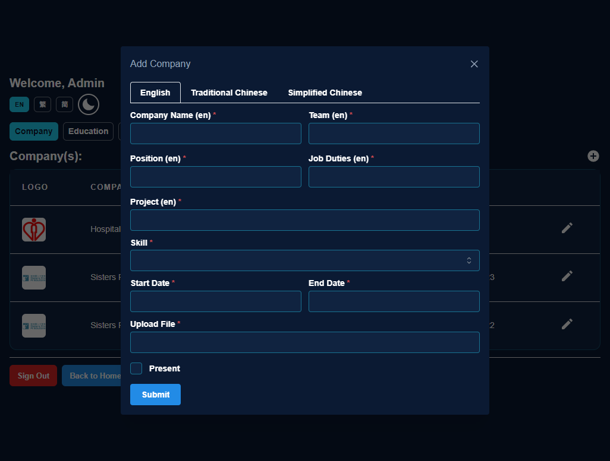 | 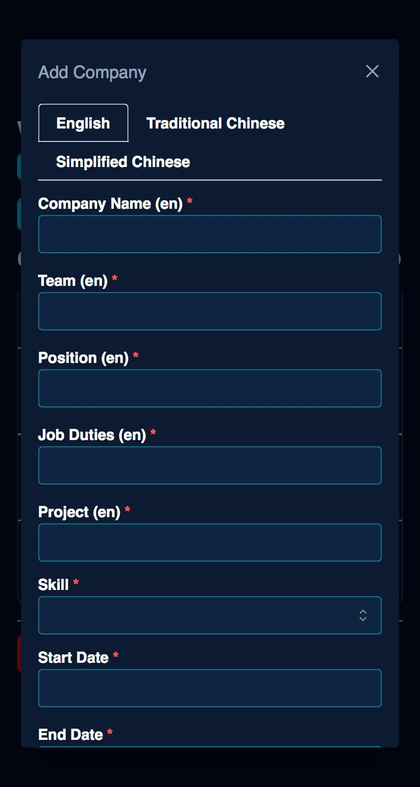 |

### Dashboard Edit Modal

The Edit modal is used to update existing content quickly. Users can revise details and save changes directly, with an interface optimized for both desktop and mobile workflows.

| Desktop | Mobile |
| --- | --- |
| 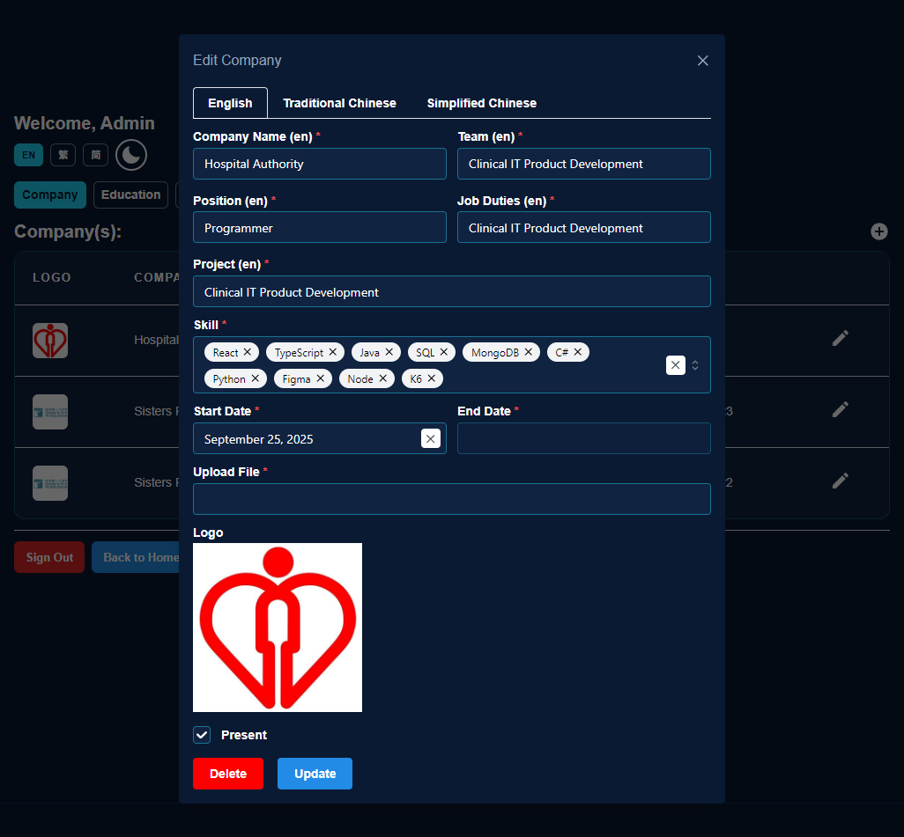 | 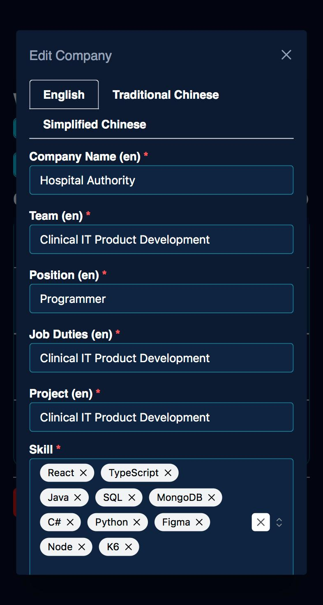 |

## Features

- Responsive layout for desktop and mobile devices.
- Public portfolio sections for work experience, education, projects, and skills.
- Dashboard CRUD workflow for content management (CRUD actions are restricted to admin users, for regular users only have read-only access).
- Authentication with Firebase Auth.
- Firestore-backed real-time data updates.
- Multilingual UI support: English, Traditional Chinese, and Simplified Chinese.
- Inline dashboard form validation with clear error feedback beside Submit or Update.
- On-demand data loading for non-critical collections to improve initial load behavior.

## Tech Stack

- Node.js
- React 18
- TypeScript
- Tailwind CSS
- Mantine
- Firebase Auth and Firestore
- Create React App

## Getting Started

### Prerequisites

- Install Node.js from [nodejs.org](https://nodejs.org/en/download)

### Environment variables

Create a .env.local file inside the bosco-mini-portfolio folder and configure:

```env
REACT_APP_FIREBASE_API_KEY=your_api_key
REACT_APP_FIREBASE_AUTH_DOMAIN=your_auth_domain
REACT_APP_FIREBASE_PROJECT_ID=your_project_id
REACT_APP_FIREBASE_STORAGE_BUCKET=your_storage_bucket
REACT_APP_FIREBASE_MESSAGING_SENDER_ID=your_messaging_sender_id
REACT_APP_FIREBASE_APP_ID=your_app_id
```

### Run the project locally

1. Open a terminal in the repository root.
1. Move into the application folder:

```bash
cd bosco-mini-portfolio
```

1. Install dependencies:

```bash
npm install
```

1. Start the development server:

```bash
npm start
```

1. Open [http://localhost:3000](http://localhost:3000) in your browser.

## Available Scripts

Inside the bosco-mini-portfolio folder, you can run:

- npm start: Runs the app in development mode
- npm run build: Builds the app for production
- npm test: Launches the test runner

## Project Structure

```text
root/
|-- .hintrc
|-- README.md
|-- netlify.toml
`-- bosco-mini-portfolio/
    |-- .env.local
    |-- .gitignore
    |-- node_modules/
    |-- package.json
    |-- package-lock.json
    |-- tsconfig.json
    |-- tailwind.config.js
    |-- public/
    |   |-- images/
    |   |   |-- personal_icon.png
    |   |   `-- readme/
    |   |       |-- Desktop_Dashboard_Page.png
    |   |       |-- Desktop_Dashboard_Page_Add_Modal.png
    |   |       |-- Desktop_Dashboard_Page_Edit_Modal.png
    |   |       |-- Desktop_Home_Page.png
    |   |       |-- Desktop_Login_Page.png
    |   |       |-- Mobile_Dashboard_Page.png
    |   |       |-- Mobile_Dashboard_Page_Add_Modal.png
    |   |       |-- Mobile_Dashboard_Page_Edit_Modal.png
    |   |       |-- Mobile_Home_Page.png
    |   |       `-- Mobile_Login_Page.png
    |   |-- index.html
    |   |-- main_logo.ico
    |   |-- main_logo.png
    |   |-- manifest.json
    |   `-- robots.txt
    |-- src/
    |   |-- App.tsx
    |   |-- index.tsx
    |   |-- index.css
    |   |-- firebase.tsx
    |   |-- react-app-env.d.ts
    |   |-- components/
    |   |   |-- dashboard/
    |   |   |   |-- modals/
    |   |   |   |   |-- DashboardCompanyModalComponent.tsx
    |   |   |   |   |-- DashboardProjectModalComponent.tsx
    |   |   |   |   |-- DashboardSchoolModalComponent.tsx
    |   |   |   |   |-- DashboardSkillModalComponent.tsx
    |   |   |   |   `-- util.tsx
    |   |   |   `-- tables/
    |   |   |       |-- CompanyTable.tsx
    |   |   |       |-- ProjectTable.tsx
    |   |   |       |-- SchoolTable.tsx
    |   |   |       |-- SkillTable.tsx
    |   |   |       `-- util.tsx
    |   |   |-- home/
    |   |   |   |-- grids/
    |   |   |   |   |-- CompanyGrid.tsx
    |   |   |   |   |-- EduGrid.tsx
    |   |   |   |   |-- ProjectGrid.tsx
    |   |   |   |   |-- SkillGrid.tsx
    |   |   |   |   `-- util.tsx
    |   |   |   |-- main/
    |   |   |   |   |-- BottomComponent.tsx
    |   |   |   |   |-- MiddleComponent.tsx
    |   |   |   |   `-- TopComponent.tsx
    |   |   |   `-- modals/
    |   |   |       |-- CompanyModalComponent.tsx
    |   |   |       |-- EducationModalComponent.tsx
    |   |   |       |-- ProjectModalComponent.tsx
    |   |   |       |-- SkillModalComponent.tsx
    |   |   |       `-- util.tsx
    |   |   |-- icon/
    |   |   |   |-- PersonalIconComponent.tsx
    |   |   |   `-- modals/
    |   |   |       `-- IntroductionModalComponent.tsx
    |   |   |-- loading/
    |   |   |   `-- MainLoading.tsx
    |   |   `-- util.tsx
    |   |-- files/
    |   |   `-- CV.pdf
    |   |-- globalVariable/
    |   |   |-- GlobalVariable.tsx
    |   |   |-- MapperContextProvider.tsx
    |   |   |-- Notification.tsx
    |   |   `-- Translation.tsx
    |   |-- pages/
    |   |   |-- Dashboard.tsx
    |   |   |-- Home.tsx
    |   |   `-- Login.tsx
    |   |-- query/
    |   |   |-- CompanyQuery.tsx
    |   |   |-- ProjectQuery.tsx
    |   |   |-- SchoolQuery.tsx
    |   |   |-- SkillQuery.tsx
    |   |   `-- UserQuery.tsx
    |   |-- types/
    |   |   |-- assets.d.ts
    |   |   |-- index.d.tsx
    |   |   `-- type.tsx
```

## Deployment

The project is deployed on Netlify:

[https://cheungtszlai.netlify.app/](https://cheungtszlai.netlify.app/)
